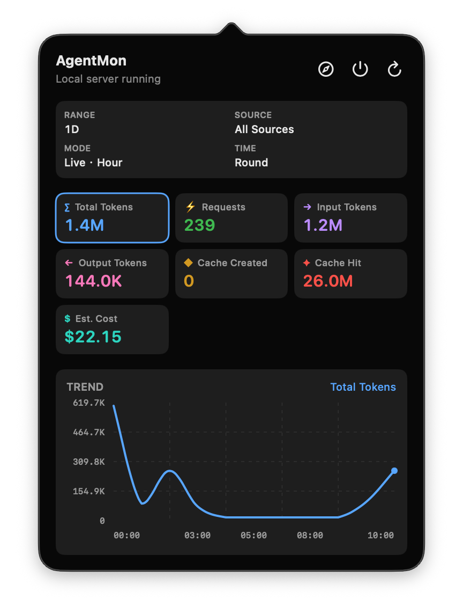

# AgentMon

AgentMon 是一个 macOS 原生状态栏应用，用于查看 Claude Code 与 Codex 的 token usage。当前交付形态是 `.app`，主界面是菜单栏 popover 和原生设置窗口。

## 界面预览

<p>
  
</p>

状态栏看板展示 token 用量卡片、趋势图、活动热力图、请求明细和 session 统计；设置窗口提供路径、默认范围、模型价格、扫描和维护操作。

## 技术栈

- App：SwiftUI / AppKit
- 数据库：SQLite3
- 配置解析：Foundation JSON

## 功能概览

- 支持 Total Tokens、Requests、Input、Output、Cache Created、Cache Hit、Est. Cost 指标切换
- 支持趋势图、最近 30 天热力图、年度热力图 popover、按模型 / 来源分布、请求日志分页
- 支持 Yesterday、Today、This Week、This Month、This Year、All 快捷时间范围
- session 标题统一使用项目文件夹名和第一句 prompt
- 支持按模型配置价格，用于费用估算
- 右上角提供原生设置窗口和退出 App

## 数据来源

### Claude Code

- `~/.claude/projects/`

### Codex

- `~/.codex/sessions/`
- `~/.codex/session_index.jsonl`

## 运行方式

开发运行：

```bash
cd macos-app
swift run AgentMon
```

打包独立版 `.app`：

```bash
bash macos-app/scripts/build-app.sh
open macos-app/release/AgentMon.app
```

App 启动后会在菜单栏显示 AgentMon 图标。点击状态栏图标可以查看实时统计、打开设置窗口或退出应用。打包产物位于 `macos-app/release/`，不会提交到 Git。

## 配置与数据

项目可以零配置运行，默认读取 `~/.claude/projects` 和 `~/.codex/sessions`。如需自定义路径，请在 App 的原生设置窗口中修改。

通过 macOS App 启动时，AgentMon 会把 SQLite 数据库、扫描状态和本地配置写入：

```text
~/Library/Application Support/AgentMon
```

## 项目结构

```text
macos-app/
  Package.swift          # SwiftPM manifest
  Sources/AgentMonApp/   # SwiftUI 状态栏 App 源码
  Tests/AgentMonAppTests/# Swift 测试
  Assets/                # App icon（.icns / .png）
  Packaging/Info.plist   # .app bundle metadata
  scripts/build-app.sh   # 独立版 .app 打包脚本
  README.md              # macOS App 使用与打包说明
docs/
  images/                # README 截图
```

根目录还包括：`AGENTS.md`（Codex 协作约定）、`CLAUDE.md`（Claude Code 协作约定）、`LICENSE` 和 README 截图资源。

## 重要说明

- AgentMon 使用本地 SQLite 索引 token usage 元数据。
- 原生 App 当前不会提供 session 删除、skill 卸载或 MCP/settings 改写入口。
- TokMon 用量数据写入 `usage_records` 表，增量扫描 offset 存在 `tokmon_scan_state`。

## License

MIT
