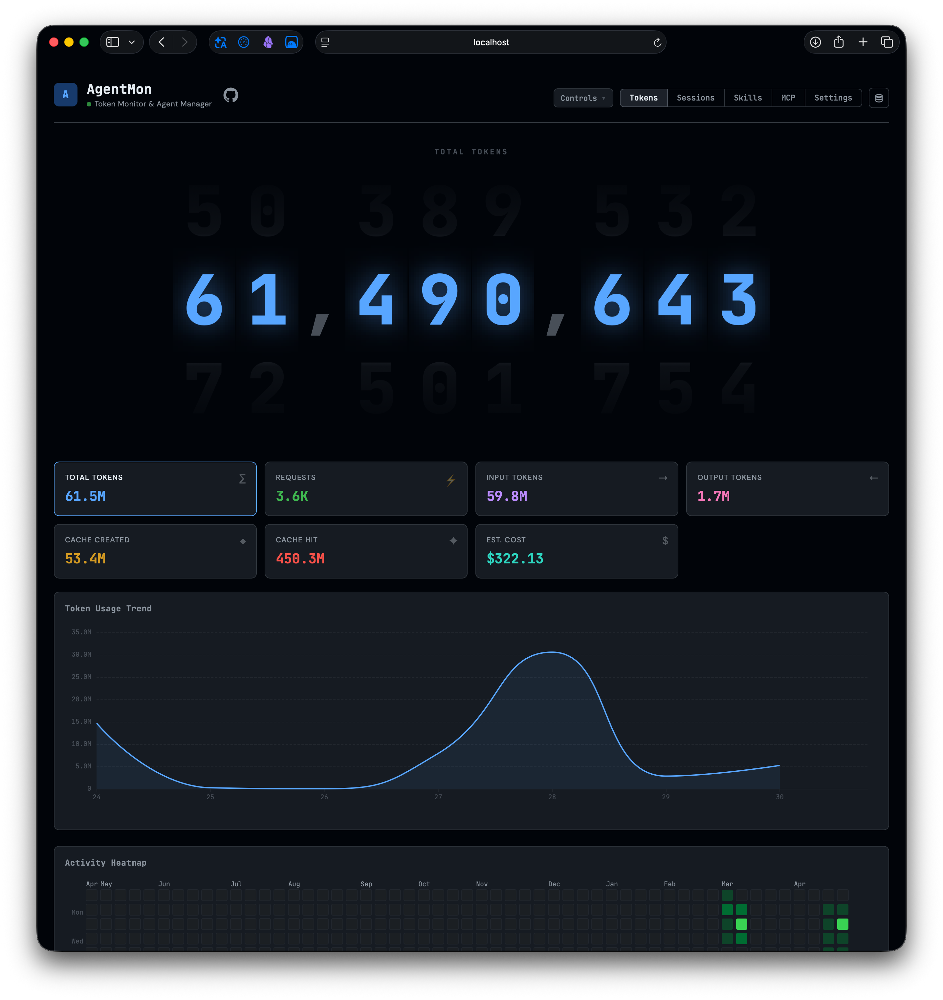

# AgentMon

AgentMon 是一个 macOS 状态栏应用，用于管理 Claude Code 与 Codex 本地数据。它启动后会自动运行内置本地服务，并通过 App 打开内置 dashboard，提供 token 用量监控，以及 sessions、skills、MCP servers 和配置文件的统一管理界面。

## 界面预览

<p>
  
</p>

<p>
  
</p>

Tokens dashboard 展示 token 用量卡片、趋势图、活动热力图和请求明细；状态栏看板提供轻量实时统计、当前范围模式和趋势预览。

## 技术栈

- 后端：Hono + @hono/node-server
- 数据库：better-sqlite3
- 前端：原生 HTML / CSS / JS
- 配置解析：smol-toml
- 运行时：TypeScript + tsx

## 功能概览

### TokMon
- 作为默认首页展示 Claude Code / Codex token 用量
- 支持 Total Tokens、Requests、Input、Output、Cache Created、Cache Hit、Est. Cost 指标切换
- 支持趋势图、活动热力图、按模型 / 来源分布、请求日志分页
- 支持 1H 到 90D 快捷时间范围、Now 实时模式、Exact / Round 范围模式
- Request Log 支持显示 session id，点击后在 Tokens 页面侧边弹出轻量 session 预览；再次点击同一 id、点击外部或页面滚动时关闭
- 支持浏览器 localStorage 保存模型价格，用于前端费用估算
- API 命名空间为 `/api/tokmon/*`，避免和 AgentMon 的 `/api/sessions` 冲突

### 状态栏看板
- 跟随 Tokens dashboard 当前 source、range、Live / Fixed、Exact / Round 和 Hour / Day 设置
- 展示 Total Tokens、Requests、Input、Output、Cache Created、Cache Hit、Est. Cost 指标
- 内置轻量趋势图，可在状态栏里快速查看近期变化
- 右上角提供打开 dashboard、退出 App 和重启 dashboard 服务入口

### Sessions
- 列出 Claude Code 与 Codex 的 session
- 按 source / keyword / active 或 archived 状态过滤
- 支持分页，并可设置每页显示数量
- 查看 session 详情
- 详情中支持一键滚动到顶部 / 底部
- 管理模式支持多选、批量归档 / 恢复、批量删除
- 支持批量迁移 session 的项目路径
- Prompt 列支持切换显示第一条有效 prompt / 最后一条有效 prompt

### Skills
- 列出已安装 skills
- 查看描述与 SKILL.md 内容
- 启用 / 禁用 skill
- 管理模式支持多选批量卸载
- 跨平台安装 / 卸载：可在 Claude Code 与 Codex 之间快速同步安装状态
- 自动识别 broken symlink
- 一键清理 broken skills

### MCP
- 列出 MCP servers
- 查看 MCP 配置
- 启用 / 禁用
- 添加 MCP server
- 管理模式支持多选批量删除
- 跨平台安装 / 卸载：可在 Claude Code 与 Codex 之间同步

### Settings
- 读取 / 保存 Claude Code settings.json
- 读取 / 保存 Codex config.toml（以前端 JSON 形式编辑）
- 查看插件列表

## 数据来源

### Claude Code
- `~/.claude/projects/`
- `~/.claude/sessions/`
- `~/.claude/skills/`
- `~/.claude/settings.json`
- `~/.claude/plugins/installed_plugins.json`

### Codex
- `~/.codex/sessions/`
- `~/.codex/session_index.jsonl`
- `~/.codex/skills/`
- `~/.codex/config.toml`

## 运行方式

AgentMon 的交付形态是 macOS 状态栏 App。打包独立版 `.app`：

```bash
bash macos-app/scripts/build-app.sh
open macos-app/release/AgentMon.app
```

App 启动后会在菜单栏显示 AgentMon 图标，并自动启动内置服务。点击状态栏图标可以查看实时统计、打开 dashboard 或退出应用。打包产物位于 `macos-app/release/`，不会提交到 Git。更多细节见 `macos-app/README.md`。

开发时也可以直接运行 Swift App：

```bash
cd macos-app
swift run AgentMon
```

Web dashboard 是 App 内置界面。调试后端或前端时，可以单独启动本地服务：

```bash
npm install
npm run dev
```

默认端口为 `3388`。

## 配置

项目可以零配置运行，默认读取 `~/.claude` 和 `~/.codex`。如需自定义路径，复制示例文件后修改：

```bash
cp agentmon.config.example.json agentmon.config.json
cp tokmon.config.example.json tokmon.config.json
```

`agentmon.config.json` 配置 Claude Code / Codex home 目录。`tokmon.config.json` 配置 token usage 日志扫描目录。真实配置文件、SQLite 数据库和本地扫描状态不会提交到 Git。

当通过 macOS App 启动时，AgentMon 会把数据库、扫描状态和本地配置写入：

```text
~/Library/Application Support/AgentMon
```

## 项目结构

```text
src/
  index.ts               # 服务入口、路由挂载、初始/周期扫描
  db.ts                  # SQLite schema、upsert/delete helpers、去重清理
  runtime-paths.ts       # 根据 AGENTMON_DATA_DIR 解析数据目录
  scanner/
    index.ts             # 配置加载与扫描调度
    claude-*.ts          # Claude Code sessions / skills / settings 扫描
    codex-*.ts           # Codex sessions / skills / settings 扫描
    utils.ts             # 扫描辅助函数
  tokmon/
    scanner.ts           # TokMon token usage 扫描器（含 Claude 回填）
  routes/
    tokmon.ts            # TokMon API（/api/tokmon/*）
    sessions.ts          # sessions API（/api/sessions）
    skills.ts            # skills API（/api/skills）
    mcp.ts               # MCP API（/api/mcp）
    settings.ts          # settings API（/api/settings）
public/
  index.html             # 单页入口
  style.css              # GitHub Dark 风格 UI
  app.js                 # AgentMon 前端逻辑（sessions / skills / MCP / settings）
  tokmon-module.js       # TokMon 同页挂载模块
  assets/                # 站点 icon 与 favicon
  vendor/echarts.min.js  # vendored ECharts，供独立版 App 离线加载
macos-app/
  Package.swift          # SwiftPM manifest
  Sources/AgentMonApp/   # SwiftUI 状态栏 App 源码
  Assets/                # App icon（.icns / .png）
  Packaging/Info.plist   # .app bundle metadata
  scripts/build-app.sh   # 独立版 .app 打包脚本
  README.md              # macOS App 使用与打包说明
docs/
  images/                # README 截图
```

根目录还包括：`package.json`、`tsconfig.json`、`agentmon.config.example.json`、`tokmon.config.example.json`、`AGENTS.md`（Codex 协作约定）、`CLAUDE.md`（Claude Code 协作约定）和 `LICENSE`。

## 重要说明

- AgentMon 使用本地 SQLite 索引元数据，但很多操作会直接修改用户真实文件：
  - 删除 session 会删除原始 session 文件
  - 安装 / 卸载 skill 会创建或删除 symlink
  - 添加 / 删除 MCP 会直接改写 settings.json 或 config.toml
- skill 的“跨平台安装”本质上是把同一个目标目录链接到另一个平台的 skills 目录
- broken skill 通常表示 symlink 还在，但真实目标目录已被删除

## 已知实现约定

- sessions 详情当前一次性加载全部消息，仅在前端提供 Top / Bottom 快捷滚动
- sessions 列表分页由后端 `/api/sessions` 负责
- session 详情接口 `/api/sessions/:id` 支持 `limit` 参数，当前前端传入大值以加载全部消息
- skills / mcp 的跨平台状态在前端按 `name` 聚合，而不是按数据库 `id`
- TokMon 用量数据写入同一个 `agentmon.db` 的 `usage_records` 表，增量扫描 offset 存在 `tokmon_scan_state`
- TokMon 日志路径来自 `tokmon.config.json`；如果不存在，默认读取 `~/.claude/projects` 和 `~/.codex/sessions`

## License

MIT
