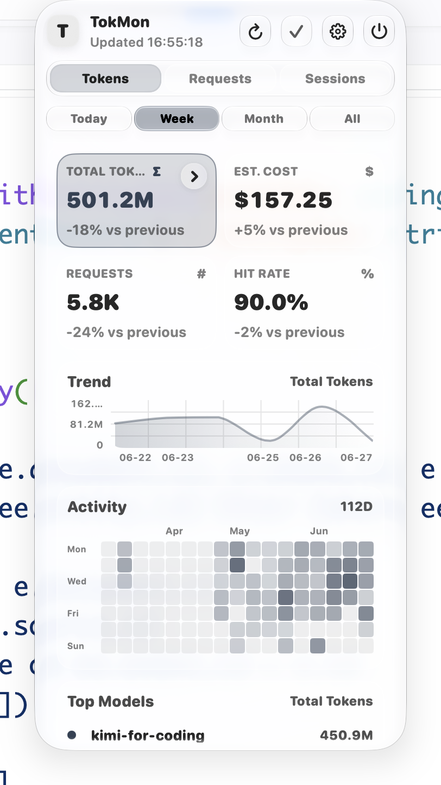
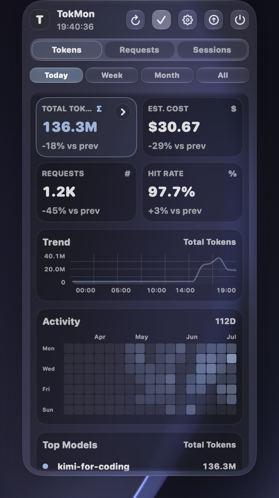

# TokMon

TokMon 是一个 macOS 原生状态栏应用，用于统一查看 Claude Code、Codex、Qwen Code 和 OpenCode 的 token usage。当前交付形态是 `.app`，主界面是菜单栏 popover 和原生设置窗口。

## 界面预览

<p>
  
  
</p>

状态栏看板展示 token 用量卡片、趋势图、活动热力图、请求明细和 session 统计；设置窗口提供路径、默认范围、模型价格、扫描和维护操作。

## 技术栈

- App：SwiftUI / AppKit
- 数据库：SQLite3
- 配置解析：Foundation JSON

## 功能概览

- 支持 Total Tokens、Requests、Input、Output、Cache Created、Cache Hit、Est. Cost 指标切换
- 支持趋势图、紧凑活动热力图、按模型 / 来源分布、请求日志分页和 session 明细
- 支持 Yesterday、Today、This Week、This Month、This Year、All 快捷时间范围
- session 标题统一使用项目文件夹名和第一句 prompt
- 支持按模型配置价格，用于费用估算
- 支持浅色与深色模式，主题色会自动适配以保证可读性
- 状态栏图标与文字跟随系统深浅色及屏幕焦点状态自动调整颜色
- 状态栏 popover 右上角提供刷新、复制截图、打开设置窗口和退出 App

## 数据来源支持

Claude Code、Codex、Qwen Code、OpenCode

## 运行方式

开发运行：

```bash
cd macos-app
swift run TokMon
```

打包独立版 `.app`：

```bash
bash macos-app/scripts/build-app.sh
open macos-app/release/TokMon.app
```

App 启动后会在菜单栏显示 TokMon 图标。点击状态栏图标可以查看实时统计、复制面板截图、打开设置窗口或退出应用。打包产物位于 `macos-app/release/`，不会提交到 Git。

## 配置与数据

项目可以零配置运行，默认读取 Claude Code、Codex、Qwen Code 和 OpenCode 的本地数据路径。需要自定义路径时，请在 App 的原生设置窗口中修改。

通过 macOS App 启动时，TokMon 会把 SQLite 数据库、扫描状态和本地配置写入：

```text
~/Library/Application Support/TokMon
```

首次从旧版 AgentMon 升级时，TokMon 会在 `~/Library/Application Support/TokMon` 不存在且旧 `~/Library/Application Support/AgentMon` 存在时迁移数据目录。若 TokMon 目录已经存在，旧目录不会被覆盖。

## 项目结构

```text
macos-app/
  Package.swift          # SwiftPM manifest
  Sources/TokMonApp/     # SwiftUI 状态栏 App 源码
  Tests/TokMonAppTests/  # Swift 测试
  Assets/                # App icon（.icns / .png）
  Packaging/Info.plist   # .app bundle metadata
  scripts/build-app.sh   # 独立版 .app 打包脚本
  README.md              # macOS App 使用与打包说明
docs/
  images/                # README 截图
```

根目录还包括：`AGENTS.md`（Codex 协作约定）、`CLAUDE.md`（Claude Code 协作约定）、`LICENSE` 和 README 截图资源。

## 重要说明

- TokMon 使用本地 SQLite 索引 token usage 元数据。
- TokMon 用量数据写入 `usage_records` 表，增量扫描 offset 存在 `tokmon_scan_state`。
- 缓存命中率只统计支持缓存命中语义的数据来源，避免不支持的来源拉低命中率。

## License

MIT
